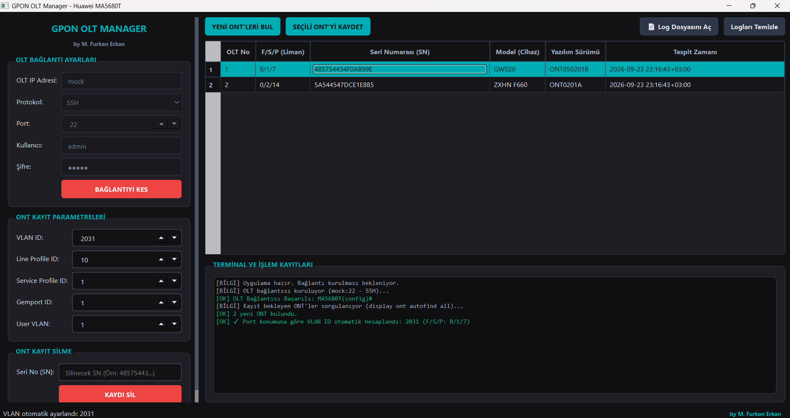
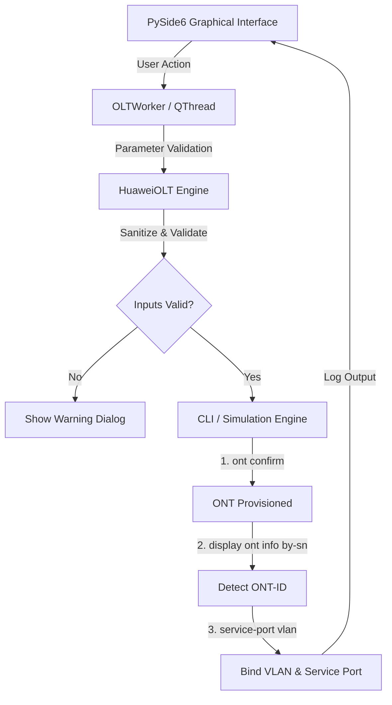

# GPON OLT Manager (Simulation Edition)

<p align="center">
  <b>Provisioning, Deprovisioning & VLAN Management Tool for Huawei GPON OLTs (MA5680T)</b><br>
  <i>PySide6 (Qt6) GUI, Automatic ONT Discovery & Dynamic VLAN Calculation</i>
</p>

<p align="center">
  
  
  
  
</p>

---

## Preview

<p align="center">
  
</p>

---

> **Note (Portfolio & Simulation Edition):**  
> This project is a desktop application developed to demonstrate automated ONT provisioning, deprovisioning, and VLAN management flows on Huawei GPON OLTs.  
> To test and demo the workflows without physical OLT hardware or network access, backend operations run on a built-in **simulation driver** that mimics CLI responses, discovery queues, and error handling.

---

## Overview

**GPON OLT Manager** is a desktop utility created to simplify routine modem registration and configuration tasks on Huawei GPON OLTs. It automates common CLI steps required when onboarding new ONTs/ONUs, reducing manual input errors during provisioning.

Key workflows include discovering unconfigured ONTs, registering them with designated line/service profiles, calculating port-specific VLAN IDs, and cleanly removing obsolete service-port configurations.

---

## Features

- **Dark Theme GUI:** Built with PySide6 (Qt for Python), featuring an eye-friendly dark interface and structured controls.
- **ONT Discovery (Autofind):** Scans and lists unconfigured ONTs with serial numbers, equipment models, firmware versions, and detection timestamps.
- **ONT Registration & VLAN Provisioning:** Automates `ont confirm`, captures the dynamically assigned `ONT-ID`, and configures the corresponding `service-port vlan` with tag transformation rules.
- **Port-Based VLAN Calculation:** Calculates the VLAN ID automatically using the slot/port formula:
  $$\text{VLAN} = 2000 + (\text{Slot} \times 24) + \text{Port}$$
- **ONT Deprovisioning:** Locates active service-ports for a given serial number, runs `undo service-port`, and de-registers the ONT from the GPON interface.
- **Local Log Access:** Provides quick access to persistent log files directly in the default system text editor.
- **Input Validation & Safety Checks:**
  - Sanitization against special characters to avoid invalid CLI inputs.
  - Regex and range validation for Serial Numbers, Frame/Slot/Port (F/S/P), VLANs, and Profile IDs.
  - Warning dialog when connecting over unencrypted Telnet.
- **Asynchronous Execution:** Uses `QThread` workers to run background tasks without blocking the UI.
- **Application Logging:** Real-time log console in the interface along with rotating file logs (`RotatingFileHandler`).

---

## Architecture & Workflow



---

## Installation & Quick Start

### 1. Prerequisites
- Python 3.10 or higher
- pip package manager

### 2. Clone the Repository
```bash
git clone https://github.com/mfurkanerkan15/gpon-olt-manager.git
cd gpon-olt-manager
```

### 3. Create and Activate Virtual Environment
```bash
# Windows
python -m venv venv
.\venv\Scripts\activate

# Linux / macOS
python3 -m venv venv
source venv/bin/activate
```

### 4. Install Dependencies
```bash
pip install -r requirements.txt
```

### 5. Run Application
```bash
python main.py
```

---

## Usage (Simulation Mode)

1. Launch the application using `python main.py`.
2. Click **"OLT'YE BAĞLAN"** (default mock host is pre-configured).
3. Click **"YENİ ONT'LERİ BUL"** to load the simulated list of unconfigured ONTs.
4. Select an ONT from the table (VLAN ID will be calculated automatically) and click **"SEÇİLİ ONT'Yİ KAYDET"**.
5. To remove a modem, enter its serial number in the deprovisioning box and click **"KAYDI SİL"**.
6. Use **"Log Dosyasını Aç"** to inspect the local log file.

---

## Configuration Parameters

| Parameter | Description | Default |
|---|---|---|
| **VLAN ID** | Service VLAN tag (1-4094) | `2024` |
| **Line Profile ID** | DBA & T-CONT bandwidth mapping profile (1-4096) | `10` |
| **Service Profile ID** | Hardware capability / port match profile (1-4096) | `1` |
| **Gemport ID** | GPON encapsulation channel ID (1-128) | `1` |
| **User VLAN** | Customer-side VLAN tag mapping (1-4094) | `1` |

---

<p align="center">
  Developed by <b>Muhammed Furkan Erkan</b>
</p>
